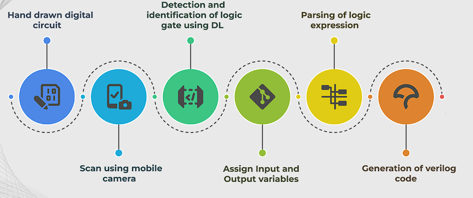
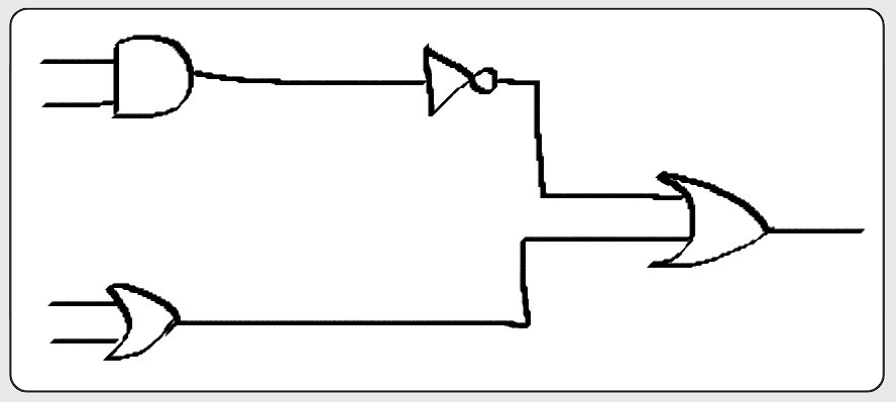
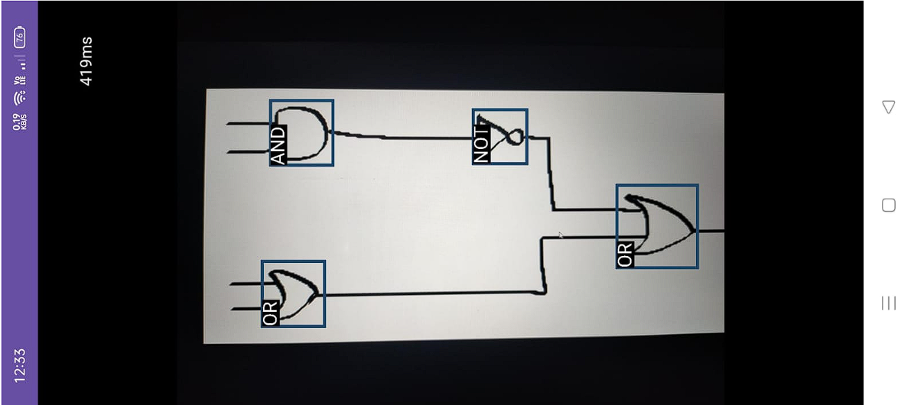
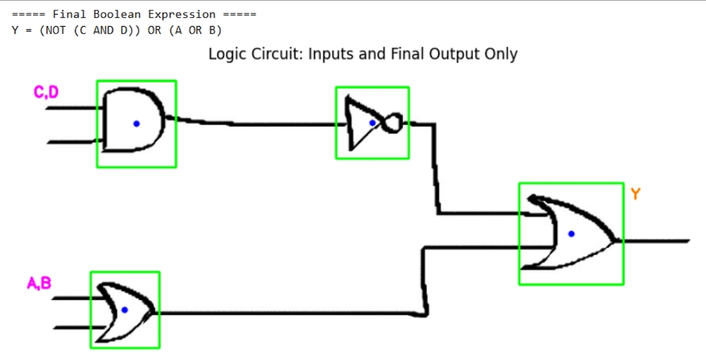
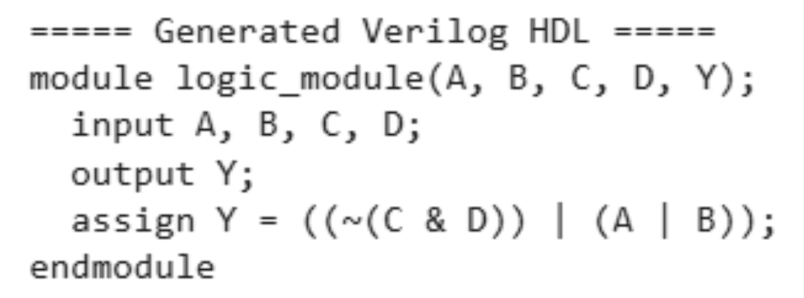

# Mobile Logic Circuit Recognition and Verilog Code Generation

We built a mobile-based tool designed to interpret digital logic circuit diagrams captured via a phone camera. The system leverages on-device deep learning to identify standard logic gates, map their interconnections, derive the corresponding Boolean expression, and generate valid Verilog code. Built for Android devices, LogiCam runs entirely offline, offering real-time circuit analysis without external dependencies.

---

## Key Capabilities

- Capture hand-drawn or printed logic diagrams using a smartphone
- Detect standard logic gates using an embedded YOLOv8n-TFLite model
- Identify signal flow between gates and assign logical variables
- Construct the full Boolean expression representing the circuit
- Automatically generate Verilog HDL code for digital design simulation
- Perform all processing on-device for fast, reliable operation

---

## Architecture Overview

The system workflow is divided into five core stages:

### 1. Image Input  
The user captures a digital circuit using the smartphone camera interface.

### 2. Logic Gate Recognition  
A YOLOv8n model, optimized and converted to TensorFlow Lite format, detects individual gates in the circuit image. Supported gate types include:
- AND
- OR
- NOT
- NAND
- NOR
- XOR
- XNOR

### 3. Interconnection Analysis  
Detected gate positions are analyzed to determine connectivity. Input and output wires are tracked, and variables are assigned to each unique line.

### 4. Boolean Logic Construction  
A logical graph is created from the circuit layout, which is then traversed to construct the Boolean expression representing the entire circuit behavior.

### 5. Verilog Code Output  
The Boolean expression is translated into synthesizable Verilog code, making the system useful for direct simulation or FPGA testing.

---

## System Block Diagram

---

## Demonstration and Results

### A. Test Input Circuit  

### B. Gate Detection (Android Application)  

### C. Variable Assignment and Connectivity  

### D. Boolean Expression (Sample Output)  
(NOT (C AND D)) OR (A OR B)

### E. Verilog Code Output

--- 

## Teammates
- Sambhram Doddamane
- Anirudh Navalgund 
- E Sujaya

 
